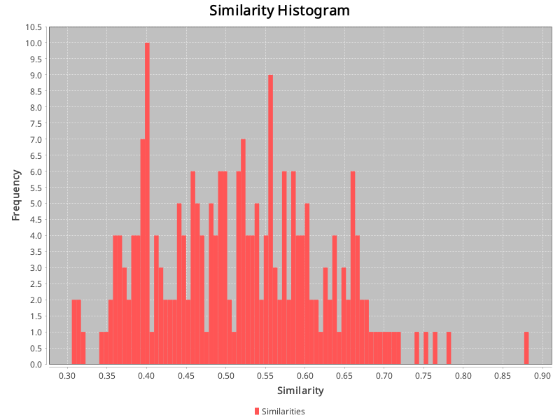

## Config:
```json
{
  "cache_dir" : "./cache/CM1-NASA",
  "gold_standard_configuration" : {
    "path" : "datasets/CM1-NASA/answer.csv",
    "hasHeader" : true,
    "swap_columns" : false
  },
  "source_artifact_provider" : {
    "name" : "text",
    "args" : {
      "artifact_type" : "requirement",
      "path" : "datasets/CM1-NASA/high"
    }
  },
  "source_preprocessor" : {
    "name" : "artifact",
    "args" : {
      "model" : ""
    }
  },
  "embedding_creator" : {
    "name" : "openai",
    "args" : {
      "model" : "text-embedding-3-large"
    }
  },
  "source_store" : {
    "name" : "custom",
    "args" : { }
  }
}
```
## Similarities:
Max similarity: 0.8826075196266174 \
Identical vectors: 0 \
Min similarity: 0.30556291341781616 \
Range: 0.5770446062088013 \
Average similarity: 0.5157660391681638 

## Identical vectors:
### Of which 0 are equivalent paraphrases.
