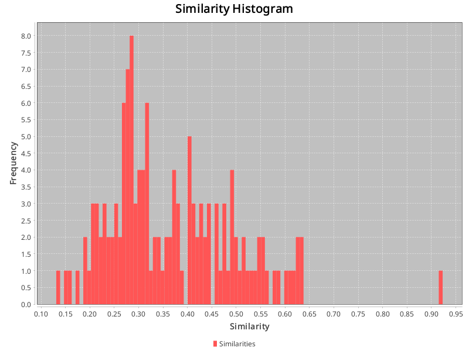

## Config:
```json
{
  "cache_dir" : "./cache/GANNT",
  "gold_standard_configuration" : {
    "path" : "datasets/GANNT/answer.csv",
    "hasHeader" : true,
    "swap_columns" : false
  },
  "source_artifact_provider" : {
    "name" : "text",
    "args" : {
      "artifact_type" : "requirement",
      "path" : "datasets/GANNT/high"
    }
  },
  "source_preprocessor" : {
    "name" : "artifact",
    "args" : {
      "model" : ""
    }
  },
  "embedding_creator" : {
    "name" : "openai",
    "args" : {
      "model" : "text-embedding-3-large"
    }
  },
  "source_store" : {
    "name" : "custom",
    "args" : { }
  }
}
```
## Similarities:
Max similarity: 0.9229306578636169 \
Identical vectors: 0 \
Min similarity: 0.13117527961730957 \
Range: 0.7917553782463074 \
Average similarity: 0.3679978621794897 

## Identical vectors:
### Of which 0 are equivalent paraphrases.
