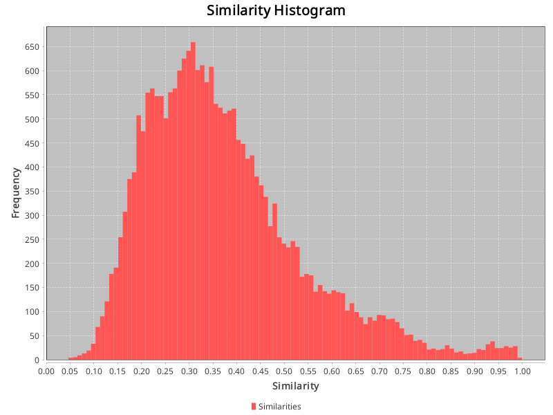

## Config:
```json
{
  "cache_dir" : "./cache/CM1-NASA-low-4omini",
  "gold_standard_configuration" : {
    "path" : "datasets/CM1-NASA/answer.csv",
    "hasHeader" : true,
    "swap_columns" : false
  },
  "source_artifact_provider" : {
    "name" : "text",
    "args" : {
      "artifact_type" : "requirement",
      "path" : "datasets/CM1-NASA/low"
    }
  },
  "source_preprocessor" : {
    "name" : "paraphrase_openai",
    "args" : {
      "model" : "o4-mini-2025-04-16",
      "temperature" : "1",
      "count" : "3",
      "seed" : "133742243",
      "template" : "Here is the text of a software {artifact_type}:\n\n{content}\n\nParaphrase the requirement, retaining its original meaning.\nAnswer with the paraphrased text only, without any additional explanation or formatting.\n"
    }
  },
  "embedding_creator" : {
    "name" : "openai",
    "args" : {
      "model" : "text-embedding-3-large"
    }
  },
  "source_store" : {
    "name" : "custom",
    "args" : { }
  }
}
```
## Similarities:
Max similarity: 0.9994194507598877 \
Identical vectors: 0 \
Min similarity: 0.04630253091454506 \
Range: 0.9531169198453426 \
Average similarity: 0.37183898504312773 

## Identical vectors:
### Of which 0 are equivalent paraphrases.
