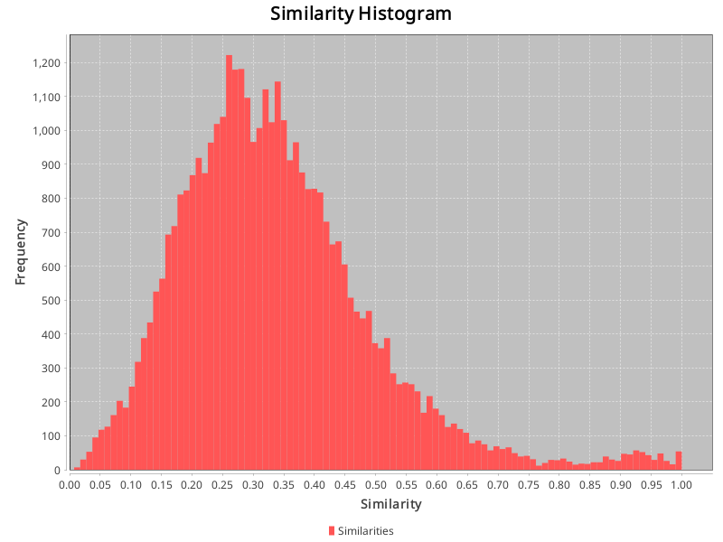

## Config:
```json
{
  "cache_dir" : "./cache/GANNT-low-4omini",
  "gold_standard_configuration" : {
    "path" : "datasets/CM1-NASA/answer.csv",
    "hasHeader" : true,
    "swap_columns" : false
  },
  "source_artifact_provider" : {
    "name" : "text",
    "args" : {
      "artifact_type" : "requirement",
      "path" : "datasets/GANNT/low"
    }
  },
  "source_preprocessor" : {
    "name" : "paraphrase_openai",
    "args" : {
      "model" : "o4-mini-2025-04-16",
      "temperature" : "1",
      "count" : "3",
      "seed" : "133742243",
      "template" : "Here is the text of a software {artifact_type}:\n\n{content}\n\nParaphrase the requirement, retaining its original meaning.\nAnswer with the paraphrased text only, without any additional explanation or formatting.\n"
    }
  },
  "embedding_creator" : {
    "name" : "openai",
    "args" : {
      "model" : "text-embedding-3-large"
    }
  },
  "source_store" : {
    "name" : "custom",
    "args" : { }
  }
}
```
## Similarities:
Max similarity: 1.0 \
Identical vectors: 35 \
Min similarity: 0.007479776628315449 \
Range: 0.9925202233716846 \
Average similarity: 0.33596807286842717 

## Identical vectors:
- ! d3_1.txtp1 and d3_1.txtp0
- d14_2.txtp1 and d12_6.txtp0
- d14_2.txtp0 and d12_6.txtp1
- ! d10_5.txtp2 and d10_5.txtp1
- ! d11_1.txtp1 and d11_1.txtp0
- ! d17_4.txtp1 and d17_4.txtp0
- ! d1_4.txtp2 and d1_4.txtp1
- d8_1.txtp0 and d6_2.txtp0
- ! d3_2.txtp2 and d3_2.txtp1
- ! d13_4.txtp1 and d13_4.txtp0
- ! d3_1.txtp2 and d3_1.txtp0
- ! d10_7.txtp2 and d10_7.txtp0
- ! d16_1.txtp2 and d16_1.txtp0
- ! d14_2.txtp1 and d14_2.txtp0
- ! d17_1.txtp2 and d17_1.txtp0
- d8_1.txtp1 and d6_2.txtp1
- ! d10_7.txtp2 and d10_7.txtp1
- ! d12_6.txtp1 and d12_6.txtp0
- ! d16_3.txtp2 and d16_3.txtp0
- ! d13_1.txtp2 and d13_1.txtp1
- ! d3_3.txtp1 and d3_3.txtp0
- ! d1_2.txtp2 and d1_2.txtp1
- ! d3_1.txtp2 and d3_1.txtp1
- d14_2.txtp1 and d12_6.txtp1
- d14_2.txtc and d12_6.txtc
- ! d2_1.txtp2 and d2_1.txtp0
- ! d12_3.txtp2 and d12_3.txtp0
- ! d17_3.txtp1 and d17_3.txtp0
- ! d2_1.txtp2 and d2_1.txtp1
- d14_2.txtp2 and d12_6.txtp2
- d8_1.txtc and d6_2.txtc
- ! d10_7.txtp1 and d10_7.txtp0
- ! d2_2.txtp1 and d2_2.txtp0
- d14_2.txtp0 and d12_6.txtp0
- ! d2_1.txtp1 and d2_1.txtp0
### Of which 26 are equivalent paraphrases.
