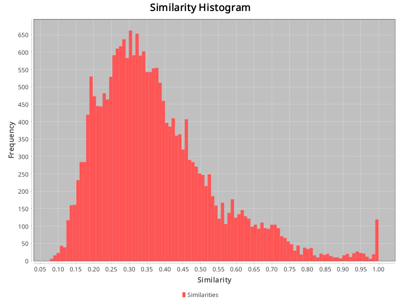

## Config:
```json
{
  "cache_dir" : "./cache/CM1-NASA-low-gpt4o",
  "gold_standard_configuration" : {
    "path" : "datasets/CM1-NASA/answer.csv",
    "hasHeader" : true,
    "swap_columns" : false
  },
  "source_artifact_provider" : {
    "name" : "text",
    "args" : {
      "artifact_type" : "requirement",
      "path" : "datasets/CM1-NASA/low"
    }
  },
  "source_preprocessor" : {
    "name" : "paraphrase_openai",
    "args" : {
      "model" : "gpt-4o-2024-11-20",
      "temperature" : "1",
      "count" : "3",
      "seed" : "133742243",
      "template" : "Here is the text of a software {artifact_type}:\n\n{content}\n\nParaphrase the requirement, retaining its original meaning.\nAnswer with the paraphrased text only, without any additional explanation or formatting.\n"
    }
  },
  "embedding_creator" : {
    "name" : "openai",
    "args" : {
      "model" : "text-embedding-3-large"
    }
  },
  "source_store" : {
    "name" : "custom",
    "args" : { }
  }
}
```
## Similarities:
Max similarity: 1.0 \
Identical vectors: 52 \
Min similarity: 0.07729604095220566 \
Range: 0.9227039590477943 \
Average similarity: 0.3758242657773052 

## Identical vectors:
- ! DPUSDS5.12.2.2p1 and DPUSDS5.12.2.2p0
- ! DPUSDS5.13.1.1.2p2 and DPUSDS5.13.1.1.2p0
- ! DPUSDS5.13.2.5p2 and DPUSDS5.13.2.5p0
- ! DPUSDS5.12.1.4.5p1 and DPUSDS5.12.1.4.5p0
- ! DPUSDS5.12.1.4.5p2 and DPUSDS5.12.1.4.5p1
- ! DPUSDS5.12.3.1p2 and DPUSDS5.12.3.1p1
- ! DPUSDS5.12.1.3.2p2 and DPUSDS5.12.1.3.2p1
- ! DPUSDS5.12.1.5.1p2 and DPUSDS5.12.1.5.1p0
- ! DPUSDS5.12.2.2p2 and DPUSDS5.12.2.2p0
- ! DPUSDS5.12.1.3.1p1 and DPUSDS5.12.1.3.1p0
- ! DPUSDS5.12.1.4.5p2 and DPUSDS5.12.1.4.5p0
- ! DPUSDS5.12.2.2p2 and DPUSDS5.12.2.2p1
- ! DPUSDS5.12.1.5.1p1 and DPUSDS5.12.1.5.1p0
- ! DPUSDS5.13.2.1p2 and DPUSDS5.13.2.1p0
- ! DPUSDS5.13.1.2.1p2 and DPUSDS5.13.1.2.1p1
- ! DPUSDS5.12.1.5.1p2 and DPUSDS5.12.1.5.1p1
- ! DPUSDS5.13.2.2p2 and DPUSDS5.13.2.2p0
- ! DPUSDS5.12.1.3.2p2 and DPUSDS5.12.1.3.2p0
- ! DPUSDS5.13.2.8p1 and DPUSDS5.13.2.8p0
- ! DPUSDS5.13.1.6.3p1 and DPUSDS5.13.1.6.3p0
- ! DPUSDS5.13.1.5.1p2 and DPUSDS5.13.1.5.1p1
- ! DPUSDS5.12.2.4p2 and DPUSDS5.12.2.4p1
- ! DPUSDS5.13.1.6.4p1 and DPUSDS5.13.1.6.4p0
- ! DPUSDS5.12.2.1p2 and DPUSDS5.12.2.1p1
- ! DPUSDS5.12.3.1p2 and DPUSDS5.12.3.1p0
- ! DPUSDS5.12.0.1p2 and DPUSDS5.12.0.1p0
- ! DPUSDS5.13.1.6.1p2 and DPUSDS5.13.1.6.1p1
- ! DPUSDS5.12.1.2.2p2 and DPUSDS5.12.1.2.2p0
- ! DPUSDS5.12.1.3.2p1 and DPUSDS5.12.1.3.2p0
- ! DPUSDS5.13.1.1.2p2 and DPUSDS5.13.1.1.2p1
- ! DPUSDS5.12.3.1p1 and DPUSDS5.12.3.1p0
- ! DPUSDS5.12.1.2.2p1 and DPUSDS5.12.1.2.2p0
- ! DPUSDS5.12.1.5.4p2 and DPUSDS5.12.1.5.4p0
- ! DPUSDS5.13.1.1.2p1 and DPUSDS5.13.1.1.2p0
- ! DPUSDS5.13.1.6.2p2 and DPUSDS5.13.1.6.2p1
- ! DPUSDS5.12.1.4.2p1 and DPUSDS5.12.1.4.2p0
- ! DPUSDS5.13.2.1p1 and DPUSDS5.13.2.1p0
- ! DPUSDS5.13.1.6.4p2 and DPUSDS5.13.1.6.4p0
- ! DPUSDS5.13.1.5.3p2 and DPUSDS5.13.1.5.3p1
- ! DPUSDS5.12.1.5.6p2 and DPUSDS5.12.1.5.6p0
- ! DPUSDS5.13.2.2p1 and DPUSDS5.13.2.2p0
- ! DPUSDS5.12.1.5.5p2 and DPUSDS5.12.1.5.5p0
- ! DPUSDS5.13.2.1p2 and DPUSDS5.13.2.1p1
- ! DPUSDS5.12.1.2.2p2 and DPUSDS5.12.1.2.2p1
- ! DPUSDS5.13.1.6.4p2 and DPUSDS5.13.1.6.4p1
- ! DPUSDS5.13.2.4p2 and DPUSDS5.13.2.4p1
- ! DPUSDS5.12.1.4.1p1 and DPUSDS5.12.1.4.1p0
- ! DPUSDS5.13.0.1p2 and DPUSDS5.13.0.1p1
- ! DPUSDS5.12.2.3p2 and DPUSDS5.12.2.3p0
- ! DPUSDS5.13.1.3.1p2 and DPUSDS5.13.1.3.1p0
- ! DPUSDS5.13.2.6p2 and DPUSDS5.13.2.6p0
- ! DPUSDS5.13.2.2p2 and DPUSDS5.13.2.2p1
### Of which 52 are equivalent paraphrases.
